# 🍽️ Gestión Restó

> 💡 *“Un buen restaurante no solo sirve comida, ¡sirve experiencia! Y esta app ayuda a hacerlo posible.”*

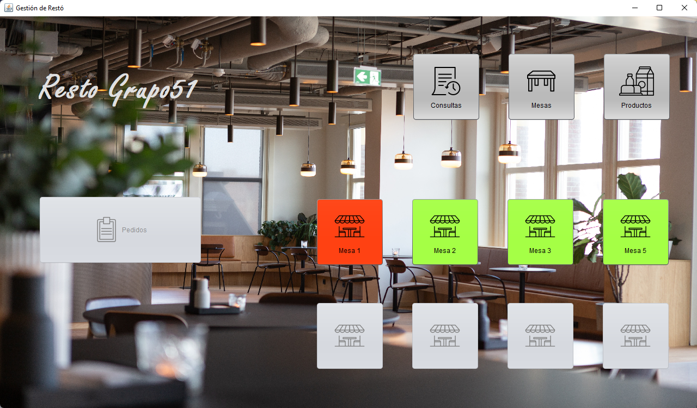

Una aplicación de escritorio desarrollada en **Java con Swing** y conectada a una base de datos **MySQL**, diseñada para gestionar eficientemente las operaciones diarias de un restaurante: desde la administración de mesas y productos hasta la creación, seguimiento y cierre de pedidos.

---

## 📌 Descripción del Proyecto

Este sistema permite a los empleados de un restaurante:

- Registrar y gestionar **mesas** (número, capacidad, estado: libre u ocupada).
- Administrar el **catálogo de productos** (comidas y bebidas) con nombre, precio y stock.
- Crear **pedidos asociados a mesas**, incluyendo múltiples productos por pedido.
- Cambiar el **estado de los pedidos**.
- Asignar un **mesero** a cada pedido.
- Calcular automáticamente **subtotales y montos totales** de cada cuenta.
- Liberar mesas al finalizar el servicio.
- Generar **reportes útiles** como:
  - Pedidos atendidos por un mesero en un día.
  - Ingresos totales por fecha.
  - Historial de pedidos de una mesa en un rango horario.

Ideal para restaurantes que buscan digitalizar su atención al cliente y optimizar su gestión interna.

---

## 🛠️ Tecnologías Utilizadas

- **Lenguaje**: Java 11+
- **Interfaz gráfica**: Java Swing
- **Base de datos**: MySQL (MariaDB)
- **Gestión de conexión**: modelo Singleton, Clase dedicada (`Conexion`) con JDBC.
- **Entorno de desarrollo**: NetBeans
- **Control de versiones**: Git + GitHub

---

## 🗂️ Estructura del Proyecto
```
GestionResto/

├── src/

│    └── restaurante/

│        ├── entidades/ Modelo # Clases del dominio: Mesa, Producto, Pedido, PedidoProducto.

│        ├── accesoAdatos/ Datos # Clases DAO: Conexion, MesaData, ProductoData, PedidoData, PedidoProductoData

│        ├── views/ Vistas # Interfaces gráficas (JFrames, JDialogs)

│    └── imagenes/ # Recursos gráficos (incl. Principal.png)

├── informacion/ # Scripts SQL para crear la base de datos

└── README.md
```

---

## ✅ Requisitos del Proyecto (según instructivo)

El sistema cumple con las tres etapas exigidas:

1. **Base de datos completa** con relaciones, clase de conexión y ABM de `Producto`.
2. **Clases del dominio completas** con encapsulamiento, constructores y métodos de negocio + **GUI funcional** en Swing.
3. **Aplicación terminada** con todos los listados, reportes y ABM de entidades relacionadas (Mesas, Pedidos, Productos).

Además:
- Uso de **abstracción**, **encapsulamiento** y **buenas prácticas de POO**.
- El proyecto se entrega con **contribuciones en GitHub** y estructura colaborativa.

---

## 🚀 Cómo Ejecutar

1. **Crear la base de datos** en MySQL usando el script `Informacion/restogrupo51.sql`, puedes tambien utilizar `Informacion/restogrupo51 - Con Datos de Pedidos.sql`, te creará la BD con datos de pedidos inclusive.
2. **Configurar los datos de conexión** en la clase `Conexion.java` en `src/restaurante/accesoADatos/Conexion.java`
3. Abrir el proyecto en **NetBeans** y ejecutar la clase principal (por ejemplo, `VistaPrincipal.java`). 

> Asegúrate de tener instalado el driver JDBC de MySQL MariaDB (`org.mariadb.jdbc.Driver`).

---

## 🖼️ Vistas Principales


> *Vista Principal.*

##

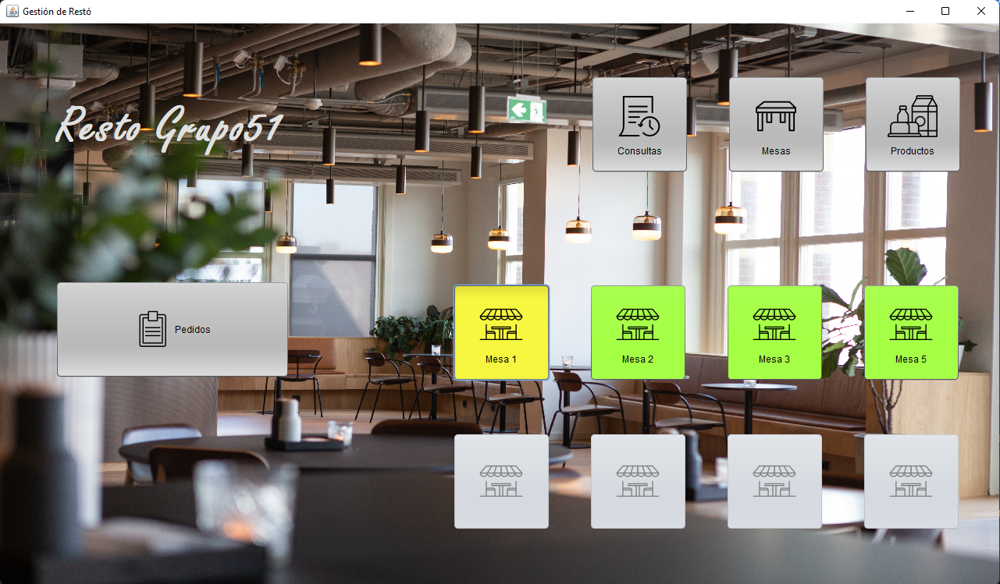
> *Seleccion de una mesa (Mesa 1).*

##

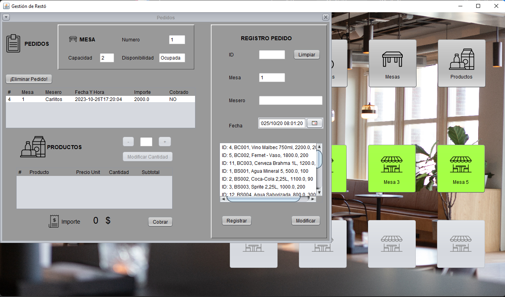
> *Ingreso de pedido (Mesa 1).*

##

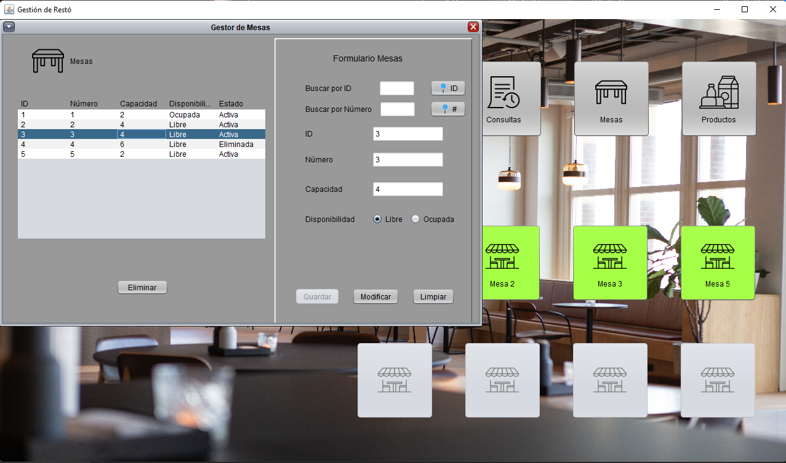
> *Gestión de Mesas (ABM).*

##

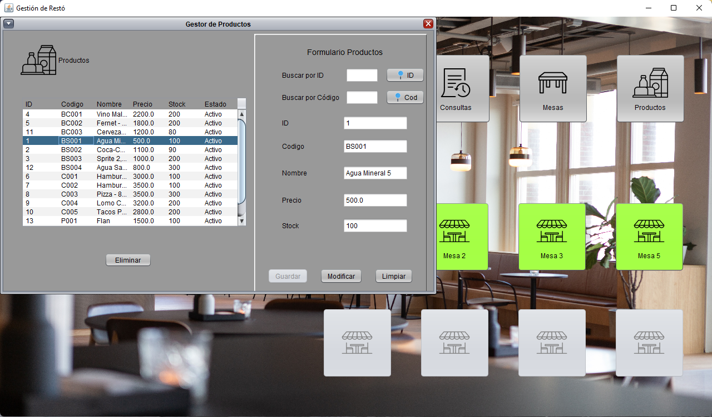
> *Gestión de Productos (ABM).*

##

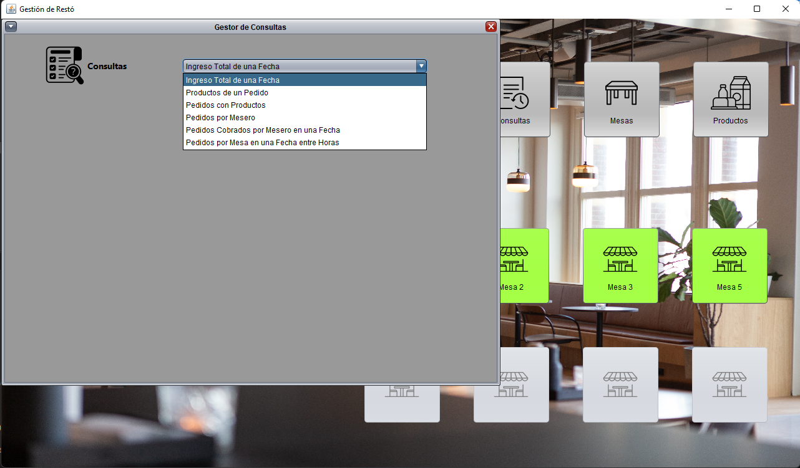
> *Vista de Consultas.*

##

<div style="display: flex; gap: 20px; justify-content: center; flex-wrap: wrap;">
    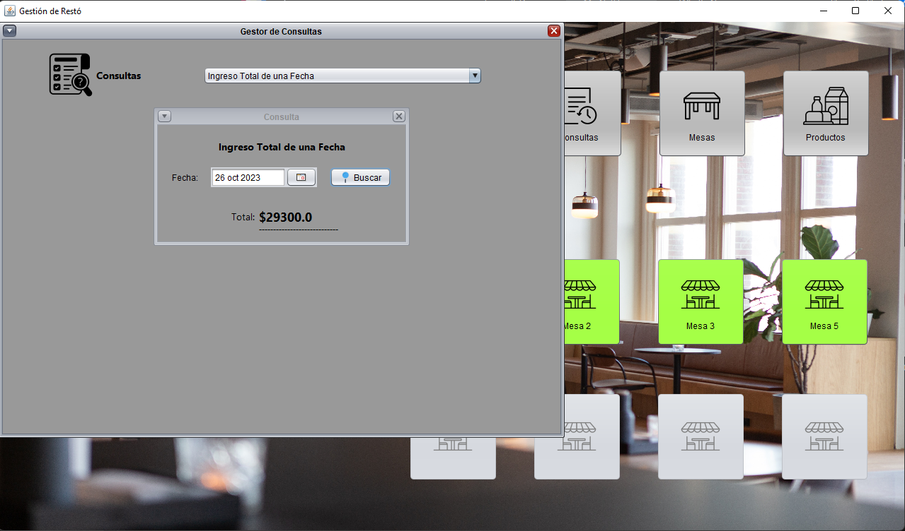
    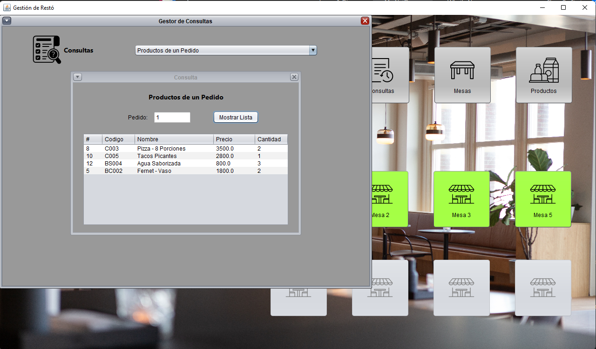
</div>

> *Consultas de Ingreso Total a una Fecha y Productos de un pedido.*

##

<div style="display: flex; gap: 20px; justify-content: center; flex-wrap: wrap;">
    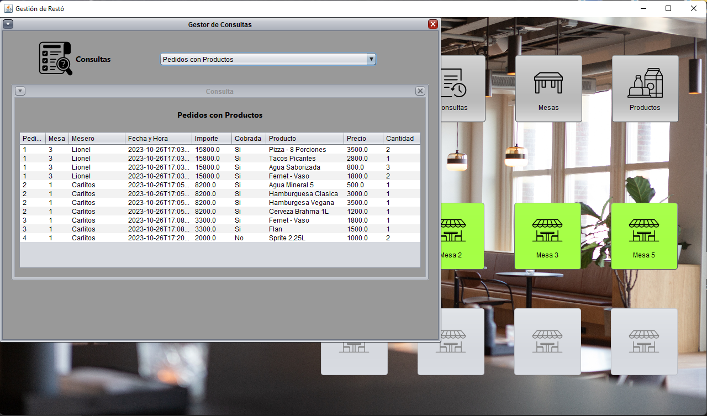
    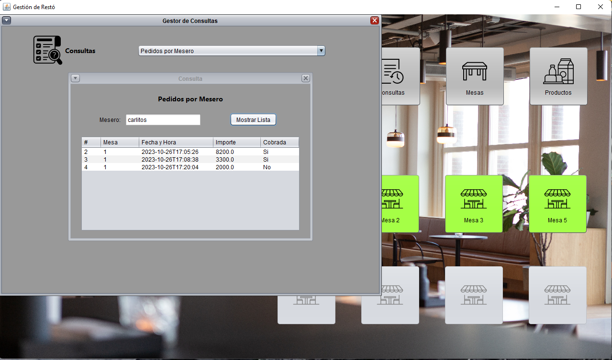
</div>

> *Consultas de Pedidos con Productos y Pedidos por Mesero.*

##

<div style="display: flex; gap: 20px; justify-content: center; flex-wrap: wrap;">
    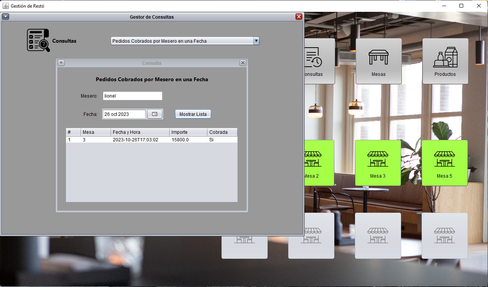
    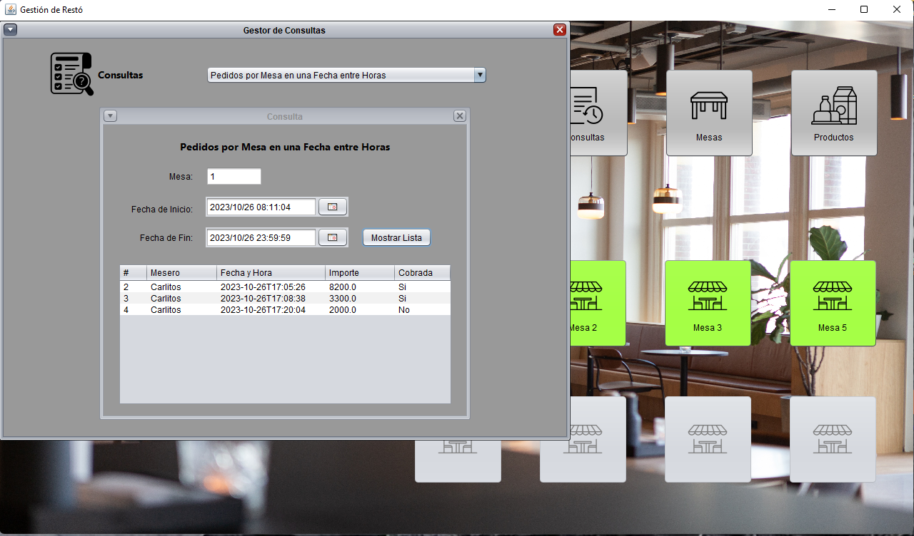
</div>

> *Consultas de Pedidos cobrados por un Mesero en una fecha y Pedidos por Mesa en una fecha y hora.*

##

---

## 🤝 Desarrollado por

Equipo de estudiantes Grupo 51 – Programa **Argentina Programa 4.0**  
Universidad de La Punta (ULP)

- Alberto Vallecillo
- Emiliando Tobal
- Melany Reinoso
- Nicolas Cuello

---
